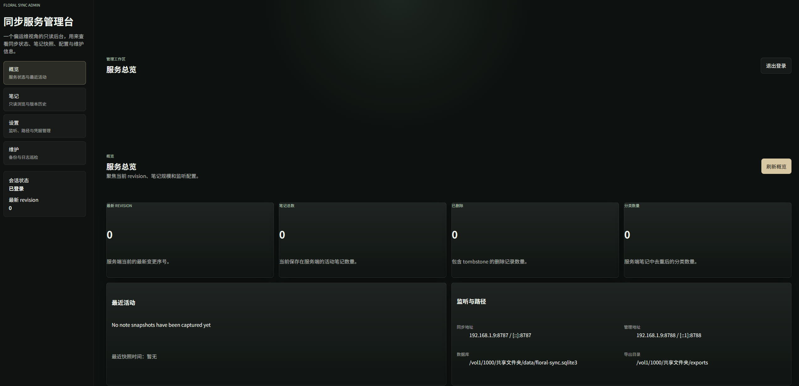

# Floral Sync Server

Floral Sync Server 是为 [Floral Notepaper](https://github.com/Achilng/floral-notepaper)
提供自建同步能力的服务端，面向个人自托管场景，使用 Rust、Axum 和 SQLite 提供同步 API，
并内嵌一个 React 管理后台用于查看状态、维护数据和调整服务端配置。

## Features

- 单用户、单笔记库同步模型
- Bearer Token 鉴权的同步 API
- 独立管理员密码与会话 Cookie 的后台登录
- SQLite 持久化最新状态、删除墓碑和备份导出
- 管理后台内嵌进单个 Rust 二进制，无需额外前端运行时
- Docker 部署默认使用宿主机目录持久化配置、数据库、导出和日志
- 启动日志直接打印当前同步 Token
- 设置页支持显示、复制、轮换同步 Token，并在托管环境中请求服务重启

## Screenshots

### 服务概览




## Scope

这个项目的目标是提供一个简单、稳定、易部署的个人同步服务，而不是多租户协作平台。

- 适合个人或家庭内部自托管
- 当前设计以单用户同步为边界
- 同步协议兼容性优先于大规模平台化扩展

## Quick Start

### 从源码运行

依赖：Rust stable、Node.js 20+、npm。

```bash
npm --prefix admin-ui ci
cargo run -- config show
cargo run
```

默认情况下：

- 同步接口监听 `127.0.0.1:8787`
- 管理后台位于 `http://127.0.0.1:8788/admin`
- 启动日志会打印当前同步 Token
- 首次打开后台会进入管理员密码引导设置流程

### 直接下载 Release 版本运行

如果你不想本地安装 Rust 和 Node.js，可以直接从
[GitHub Releases](https://github.com/LowValueTarget777/floral-sync-server/releases)
下载已经编译好的二进制文件。

可用产物：

- Windows: `floral-sync-server-vX.Y.Z-x86_64-pc-windows-msvc.zip`
- 常见 Linux 发行版（Debian / Ubuntu / Fedora 等）: `floral-sync-server-vX.Y.Z-x86_64-linux-gnu.tar.gz`
- Alpine 或其他 musl 环境: `floral-sync-server-vX.Y.Z-x86_64-linux-musl.tar.gz`
- 仅保留同步能力的 lite 版本会以 `floral-sync-server-lite-vX.Y.Z-*` 命名，不包含内嵌管理后台，也不会监听管理端口

解压后就可以直接运行：

- Windows: 直接打开 `floral-sync-server.exe`
- Linux: 给二进制执行权限后直接运行 `./floral-sync-server`

第一次启动时，程序会在可执行文件所在目录自动创建 `sync-server.toml`。

如果你需要修改监听地址、数据库路径、日志路径、导出目录或同步 Token，直接编辑这个
`sync-server.toml` 文件即可，然后重新启动服务。

二进制直接运行时，默认端口、同步 Token 日志输出和首次管理员密码引导流程与源码运行一致。

### Docker 部署（推荐）

已发布的公开镜像：`namelsscinder/floral-sync-server`。

推荐直接使用下面这个最小 compose 示例。请把它保存为 `compose.yml`：

```yaml
services:
  floral-sync-server:
    image: namelsscinder/floral-sync-server:0.1.1
    restart: unless-stopped
    ports:
      - "8787:8787"
      - "8788:8788"
    environment:
      FLORAL_SYNC_LISTEN: 0.0.0.0:8787
      FLORAL_ADMIN_LISTEN: 0.0.0.0:8788
      FLORAL_CONFIG_PATH: /var/lib/floral-sync/config/sync-server.toml
      FLORAL_DB_PATH: /var/lib/floral-sync/data/floral-sync.sqlite3
      FLORAL_EXPORT_DIR: /var/lib/floral-sync/exports
      FLORAL_LOG_PATH: /var/lib/floral-sync/logs/floral-sync-server.log
      FLORAL_LOG_LEVEL: info
    volumes:
      - ./floral/config:/var/lib/floral-sync/config
      - ./floral/data:/var/lib/floral-sync/data
      - ./floral/exports:/var/lib/floral-sync/exports
      - ./floral/logs:/var/lib/floral-sync/logs
    read_only: true
    tmpfs:
      - /tmp
      - /run
    security_opt:
      - no-new-privileges:true
    cap_drop:
      - ALL
```

启动：

```bash
docker compose up -d
```

如果你更喜欢单条命令启动，等价的 `docker run` 示例是：

```bash
docker run -d \
  --name floral-sync-server \
  --restart unless-stopped \
  -p 8787:8787 \
  -p 8788:8788 \
  -e FLORAL_SYNC_LISTEN=0.0.0.0:8787 \
  -e FLORAL_ADMIN_LISTEN=0.0.0.0:8788 \
  -e FLORAL_CONFIG_PATH=/var/lib/floral-sync/config/sync-server.toml \
  -e FLORAL_DB_PATH=/var/lib/floral-sync/data/floral-sync.sqlite3 \
  -e FLORAL_EXPORT_DIR=/var/lib/floral-sync/exports \
  -e FLORAL_LOG_PATH=/var/lib/floral-sync/logs/floral-sync-server.log \
  -e FLORAL_LOG_LEVEL=info \
  -v "$(pwd)/floral/config:/var/lib/floral-sync/config" \
  -v "$(pwd)/floral/data:/var/lib/floral-sync/data" \
  -v "$(pwd)/floral/exports:/var/lib/floral-sync/exports" \
  -v "$(pwd)/floral/logs:/var/lib/floral-sync/logs" \
  --read-only \
  --tmpfs /tmp \
  --tmpfs /run \
  --security-opt no-new-privileges:true \
  --cap-drop ALL \
  namelsscinder/floral-sync-server:0.1.1
```

容器首次启动时，如果没有显式提供 `FLORAL_SYNC_TOKEN` 和 `FLORAL_ADMIN_SESSION_SECRET`，镜像会自动生成它们，
写入宿主机上的 `sync-server.toml`，并在日志里打印同步 Token。

如果你需要使用仓库里维护的模板文件、`.env` 覆盖项或源码构建模式，详细说明见 [docs/deployment.md](docs/deployment.md)。

## Deployment

- Compose 模板位于 [docker/compose.yml](docker/compose.yml)
- 可选环境变量模板位于 [docker/.env.example](docker/.env.example)
- 默认宿主机持久化目录为 `./floral/config`、`./floral/data`、`./floral/exports`、`./floral/logs`
- 详细部署、反向代理、systemd 和 NAS 注意事项见 [docs/deployment.md](docs/deployment.md)

## Documentation

- [docs/deployment.md](docs/deployment.md): Docker、二进制部署、反向代理、备份和运维注意事项
- [docs/development.md](docs/development.md): 本地开发环境、测试和联调工作流
- [docs/build.md](docs/build.md): 本地构建、交叉编译和构建脚本说明
- [docs/release.md](docs/release.md): 版本发布、Docker 镜像发布和发布后核对流程
- [docs/protocol.md](docs/protocol.md): 同步协议和接口边界

## Release Management

- 项目版本号来自 [Cargo.toml](Cargo.toml)
- 二进制发布脚本位于 [scripts/build.ps1](scripts/build.ps1)、[scripts/build.sh](scripts/build.sh)、[scripts/release.ps1](scripts/release.ps1)、[scripts/release.sh](scripts/release.sh)
- Docker 镜像发布脚本位于 [scripts/docker-release.ps1](scripts/docker-release.ps1) 和 [scripts/docker-release.sh](scripts/docker-release.sh)
- 当前公开镜像仓库为 `namelsscinder/floral-sync-server`
- 维护者发布流程详见 [docs/release.md](docs/release.md)

## Contributing

欢迎提交 issue、文档修订和代码改进。贡献说明见 [CONTRIBUTING.md](CONTRIBUTING.md)。

## License

本项目使用 [MIT License](LICENSE)。


